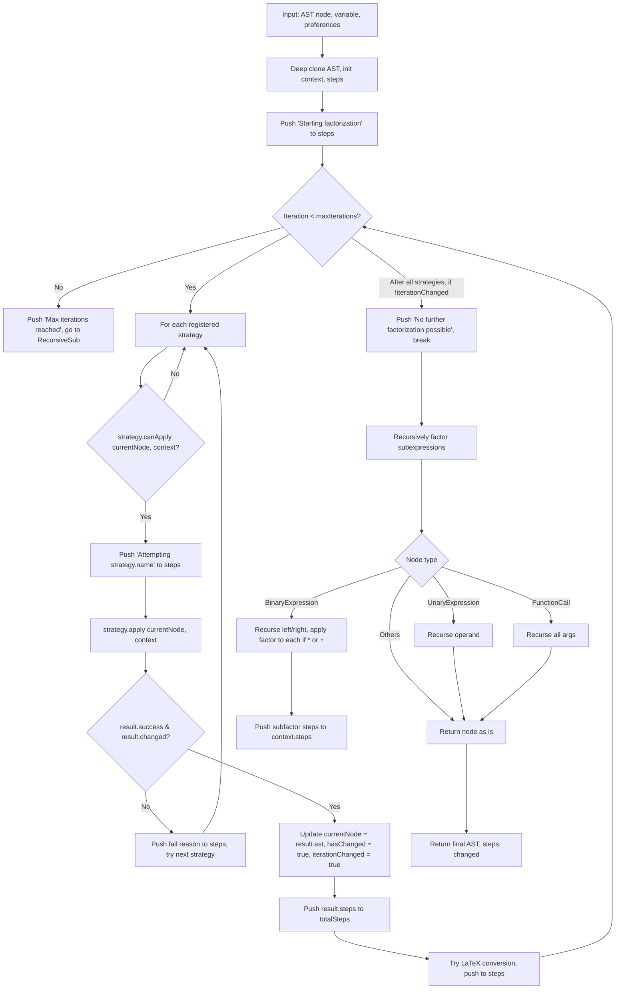
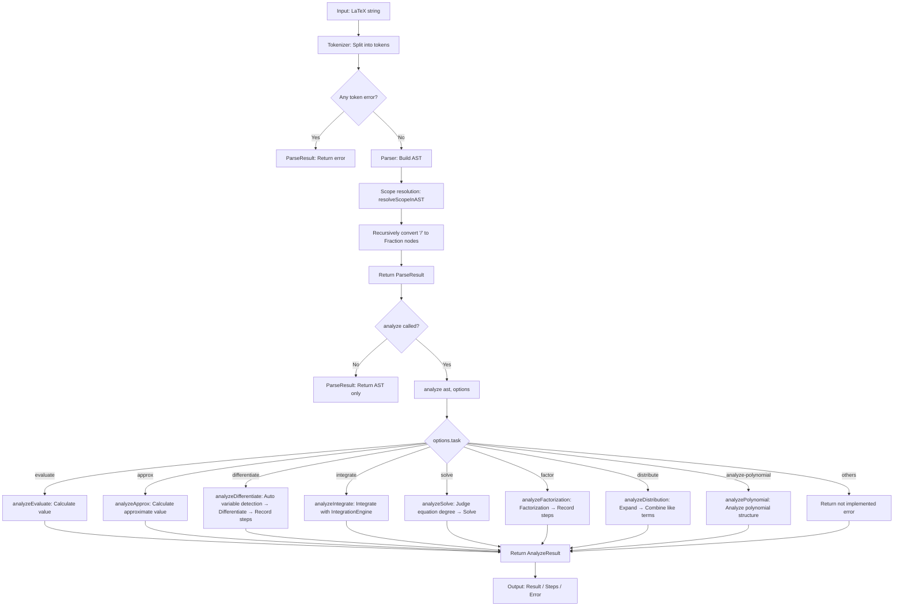

---
#### Factorization Process (Mermaid)

example:
```mermaid
    F1[PatternRecognitionStrategy] --> F2[findPattern node]
    F2 --> F3{Pattern found?}
    F3 -- Yes --> F4[pattern.factor node → new AST]
    F3 -- No --> F5[Return unchanged]
    F4 --> F6[Push pattern name to steps]
    F6 --> F7[Return changed AST, steps]

    G1[CommonFactorStrategy] --> G2[Extract terms, coefficients, variables]
    G2 --> G3[Find numeric GCD, common variables]
    G3 --> G4{Any common factor?}
    G4 -- Yes --> G5[Build factored AST, push steps]
    G4 -- No --> G6[Return unchanged]

    H1[DifferenceOfSquaresStrategy] --> H2[Check a^2 - b^2 form]
    H2 --> H3{Match?}
    H3 -- Yes --> H4[Build, push steps]
    H3 -- No --> H5[Return unchanged]

    I1[BerlekampZassenhausStrategy] --> I2[Check polynomial degree, not already factored]
    I2 --> I3{Degree >= 2?}
    I3 -- Yes --> I4[berlekampZassenhausFactor]
    I4 --> I5{Factors found?}
    I5 -- Yes --> I6[Build product AST, push steps]
    I5 -- No --> I7[Return unchanged]

    J1[LLLFactorizationStrategy] --> J2[Check degree >= 3, not already factored]
    J2 --> J3[lllFactor]
    J3 --> J4{Factors found?}
    J4 -- Yes --> J5[Build product AST, push steps]
    J4 -- No --> J6[Return unchanged]

    K1[PowerSubstitutionStrategy] --> K2[Detect x^<nk> + ... form]
    K2 --> K3{Can substitute t = x^k?}
    K3 -- Yes --> K4[Factor as poly in t, back-substitute, push steps]
    K3 -- No --> K5[Return unchanged]

    L1[PerfectPowerStrategy] --> L2[Detect <ax+b>^k expansion]
    L2 --> L3{Match?}
    L3 -- Yes --> L4[Build AST, push steps]
    L3 -- No --> L5[Return unchanged]

    M1[GroupingStrategy] --> M2[Extract 4+ terms, try groupings]
    M2 --> M3{Grouping yields factorization?}
    M3 -- Yes --> M4[Build grouped AST, push steps]
    M3 -- No --> M5[Return unchanged]
```

